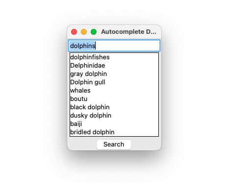

# AutoSuggest-words


## Features
This is a Python program that demonstrates an autocomplete feature using the Tkinter library for the GUI and SQLite for database operations.

- SQLite Database: It uses a SQLite database named 'taxonomy_names.db' which contains a table 'organism_names_fts' to store and retrieve organism data.
- Levenshtein Distance Algorithm: The application uses this algorithm to find and suggest the closest matching organism names based on user input.
- Dynamic User Interface: Suggestions update dynamically with each keystroke.

## Installation

1. Clone the repository

```bash
git clone https://github.com/tracywong117/AutoSuggest-words.git
```

2. Navigate to the project directory:

```bash
cd AutoSuggest-words
```

3. Install the required packages:

```bash
pip install -r requirements.txt
```

## Usage

```bash
python main.py
```